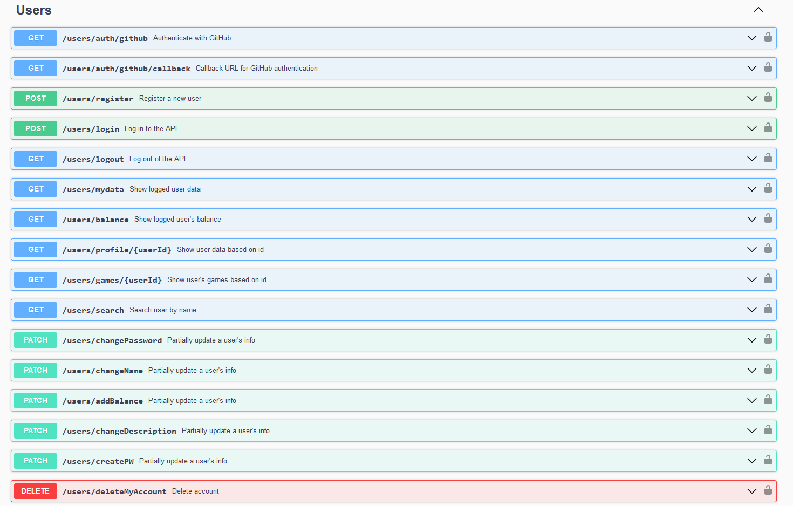

# C3: Product

## Implementation details

In this project, we fulfilled every suggested objective:

- More than 4 verbs:

  

- 3 resources:

  

- 1:n cardinality relationship between two of the resources:
  - Each user has multiple comments and multiple games.
  - Each user can have multiple active sessions.
  - Each game has multiple comments.

- Representations of resource states in JSON:

  

- Authentication and authorization layer for resource access:
  - There are 2 layers of authorization:
    - A user without login can only access the game list (cannot purchase or comment) and the respective login and registration pages.
    - A logged-in user can access games, purchase them, comment on them, access other users' profiles, and edit their own profile settings.
    - Only a user with Admin role can create and edit games.

- API documentation using OpenAPI 3.0 format:

  
  

- Authentication:
  - Authentication is done through JWT tokens. When a user logs in, they receive an authentication token (valid for 30 minutes) and a refresh token (valid for 7 days), which allow them to make requests to the server.
  - The authentication token is stored as a cookie in the browser, and the refresh token is stored in our database in the sessions table.
  - To register with GitHub, users are redirected to the GitHub page, where they authorize our application and we receive their GitHub token. We use this token to verify their email and some user information, which we store in our database. The authentication process for these users is the same.

---

[< Previous](c2.md) | [^ Main](../../../) | Next >
:--- | :---: | ---:
